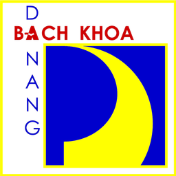

# DUT Calendar (Home Assistant custom integration)

<p align="center">
  
</p>

Tích hợp tùy chỉnh cho Home Assistant, gộp dữ liệu từ Trường Đại học
Bách khoa - Đại học Đà Nẵng vào **1 component duy nhất**, chia thành
**3 loại nguồn** — mỗi loại là 1 config entry riêng, chọn qua menu khi
thêm tích hợp:

| Loại | Cần đăng nhập? | Dữ liệu |
|---|---|---|
| **`dut_lichtuan`** | Không | Lịch tuần công khai, cảnh báo theo từ khóa |
| **`dut_coithi`** | Có | Lịch coi thi đã đăng ký |
| **`dut_deadline_diem`** | Có | Hạn nộp điểm (không đụng điểm/thông tin sinh viên) |

Có thể dùng 1, 2, hoặc cả 3 loại cùng lúc — mỗi loại là 1 "thiết bị"
riêng trong Home Assistant, không phụ thuộc lẫn nhau.

## Cài đặt

1. Copy `custom_components/dut_calendar/` vào `config/custom_components/`.
2. Khởi động lại Home Assistant.
3. **Cài đặt → Thiết bị & Dịch vụ → Thêm tích hợp**, tìm "DUT Calendar".
4. Chọn 1 trong 3 nguồn ở menu hiện ra, điền form tương ứng.
5. Muốn dùng thêm nguồn khác: lặp lại bước 3-4.

## `dut_lichtuan` — Lịch tuần công khai

- Không cần đăng nhập, lấy từ `lichtuan.dut.udn.vn`.
- Cấu hình từ khóa dạng nhiều dòng, mỗi dòng 1 nhóm (gộp tên đầy đủ +
  viết tắt):
  ```
  Lê Minh Tiến: Lê Minh Tiến, LMT, Thầy Tiến
  Khoa Cơ khí Giao thông: Khoa Cơ khí Giao thông, CKGT
  Bộ môn Kỹ thuật Ô tô: Kỹ thuật Ô tô, KTOT
  ```
- Tạo 1 sensor tổng + 1 sensor riêng mỗi nhóm từ khóa, và Calendar `calendar.lich_tuan`.
- Chỉ cảnh báo mục **mới**, không lặp lại.
- Quét **cả bảng lịch chính lẫn bảng "PHỤ LỤC"** (2 bảng tách biệt trên
  trang) — mục nào tới từ Phụ lục sẽ có gắn cờ `phu_luc: true` trong
  attributes và tiền tố `[Phụ lục]` trong thông báo, để phân biệt.
- Tuần/năm học hiện tại được **đọc trực tiếp** từ dropdown có sẵn trên
  trang (không tự tính công thức) — an toàn trước việc trường đổi
  ranh giới năm học hoặc số tuần mỗi năm (52 hay 53 tuần) mà không
  báo trước.
- **Tiêu đề sự kiện Calendar có tiền tố `[Tên nhóm từ khóa]`** (vd
  `[Khoa Cơ khí Giao thông] Hội ý Ban Giám hiệu`) — biết ngay mục nào
  khớp theo nhóm nào khi nhìn lịch, nhất là khi cấu hình nhiều nhóm
  cùng lúc. Nếu 1 mục khớp nhiều nhóm, tiền tố liệt kê đủ (vd `[Lê
  Minh Tiến, Khoa Cơ khí Giao thông]`).
- **Chế độ cập nhật** (chọn khi cài đặt hoặc sửa qua Options):
  - **"Chỉ tuần hiện tại + tuần mới (từ cuối tuần)"** — mặc định gọn
    nhẹ nhất: mỗi lần quét chỉ tải tuần hiện tại (1 request); từ
    **Thứ 6** trở đi trong tuần mới tải thêm tuần kế tiếp (trường
    thường công bố lịch tuần sau vào khoảng cuối tuần). Bỏ qua cấu
    hình "Số tuần kiểm tra thêm" ở chế độ này.
  - **"Toàn bộ"** — hành vi như trước: luôn tải tuần hiện tại + đúng
    số tuần đã cấu hình ở "Số tuần kiểm tra thêm", bất kể ngày nào
    trong tuần.
- **Dữ liệu tuần cũ có được giữ lại không?** Có — mỗi mục khớp từ khóa
  được **gộp vào lịch sử** thay vì bị thay thế hoàn toàn mỗi lần quét.
  Khi trang chuyển sang tuần mới (không còn được quét tới nữa), mục
  của tuần cũ vẫn hiển thị trên sensor/Calendar trong **14 ngày** kể
  từ ngày diễn ra sự kiện, sau đó tự động dọn bớt để không phình to
  vô hạn. Nhờ vậy duyệt lùi lại tuần trước trên Lovelace Calendar vẫn
  thấy dữ liệu, không bị trống.
- **Nếu trường sửa lại 1 mục đã có (đổi giờ/địa điểm/chủ trì) thì
  sao?** Bản sửa sẽ **ghi đè** đúng vị trí bản cũ trong lịch sử (dựa
  trên khóa ổn định = ngày + nội dung), **không** tạo thành 2 mục hiển
  thị song song trên Calendar. Vẫn có cảnh báo báo "có thay đổi" như
  bình thường (vì nội dung chi tiết đã khác), chỉ là không bị nhân đôi
  khi hiển thị.
- **Nếu đổi từ khóa trong Options thì sao?** Toàn bộ lịch sử **bị xóa
  sạch và quét lại từ đầu** — cố ý làm vậy để tránh hiện lại mục chỉ
  khớp theo từ khóa CŨ (đã xóa/đổi), dữ liệu không còn đúng với cấu
  hình hiện tại. Đánh đổi: mất tạm phần lịch sử của các tuần không
  còn được quét lại ngay trong lần quét đó — chấp nhận được, vì hiện
  dữ liệu sai còn tệ hơn nhiều so với tạm thời thiếu vài mục cũ.
- **Xóa lịch sử thủ công:** trong Options có tick **"Xóa lịch sử cũ"**
  (mặc định **tắt**) — tick vào rồi Submit sẽ xóa sạch toàn bộ lịch sử
  đã lưu ngay lần quét kế tiếp, sau đó tick **tự tắt lại**, không cần
  tự tắt tay và không xóa lặp lại ở các lần quét sau.

## Sensor đếm số sự kiện (cả 3 loại)

Mỗi loại (`dut_lichtuan`, `dut_coithi`, `dut_deadline_diem`) đều có
thêm 5 sensor đếm, tính theo giờ hệ thống của Home Assistant:

- **Hôm nay** — số sự kiện rơi đúng ngày hôm nay.
- **Ngày mai** — số sự kiện rơi đúng ngày mai.
- **Tuần này** — số sự kiện trong tuần hiện tại (Thứ 2 → Chủ nhật).
- **Tuần sau** — số sự kiện trong tuần kế tiếp (Thứ 2 → Chủ nhật).
- **Tháng này** — số sự kiện trong tháng hiện tại.

Với `dut_lichtuan`: đếm theo mục lịch tuần khớp từ khóa. Với
`dut_coithi`: đếm theo ca coi thi. Với `dut_deadline_diem`: đếm theo
mốc hạn nộp điểm (thi chung + từng lớp gộp lại).

**Riêng `dut_lichtuan`: có thêm 1 bộ 5 sensor đếm này cho TỪNG NHÓM từ
khóa** (vd "Lê Minh Tiến: Hôm nay", "Lê Minh Tiến: Tuần này"...), bên
cạnh bộ đếm TỔNG (gộp mọi nhóm) đã có sẵn — tổng cộng `5 × (1 + số
nhóm từ khóa)` sensor đếm cho riêng `dut_lichtuan`.

## Tên thiết bị & Calendar

Mỗi loại nguồn là 1 thiết bị riêng, entity Calendar **lấy thẳng tên
thiết bị** (không ghép "thiết bị + entity") nên danh sách lịch không
bị lặp:

| Thiết bị | Calendar hiển thị |
|---|---|
| DUT Calendar - Lịch tuần | `DUT Calendar - Lịch tuần` |
| DUT Calendar - Coi thi | `DUT Calendar - Coi thi` |
| DUT Calendar - Nhập điểm | `DUT Calendar - Nhập điểm` |
| DUT Calendar - Lịch dạy | `DUT Calendar - Lịch dạy` |

## Calendar — tên rút gọn

- `dut_lichtuan` → Calendar **`Lịch tuần`**
- `dut_coithi` → Calendar **`Coi thi`**
- `dut_deadline_diem` → Calendar **`Nhập điểm`** *(mới)* — mỗi mốc hạn
  (giữa kỳ, thành phần, thi chung, đính chính...) hiển thị thành 1 sự
  kiện **cả ngày** trên đúng ngày hết hạn, xem trực quan trên Lovelace
  Calendar card thay vì chỉ đọc attributes của sensor.

## Đổi Options có tự cập nhật sensor không?

Có — mọi thay đổi qua Options (từ khóa, học kỳ, tài khoản...) đều làm
Home Assistant **tự reload toàn bộ entry** ngay sau khi lưu, sensor và
calendar cập nhật theo dữ liệu mới ngay trong lần tải đầu tiên sau đó,
không cần khởi động lại HA hay thao tác gì thêm.

## `dut_coithi` / `dut_deadline_diem` — quy trình cài đặt

1. **Bước 0 — Chọn tài khoản** *(chỉ hiện nếu đã có ≥1 tài khoản cấu
   hình từ trước, ở nguồn `dut_coithi` hoặc `dut_deadline_diem`
   khác)*: chọn dùng lại tài khoản đã có (khỏi gõ mật khẩu lần nữa),
   hoặc chọn "+ Tài khoản khác" để nhập tài khoản mới. Ví dụ: đã thêm
   `dut_coithi` với tài khoản A, giờ thêm `dut_deadline_diem` — có
   thể chọn lại tài khoản A ngay, không cần đăng nhập lại từ đầu.
2. **Bước 1 — Đăng nhập:** nhập (hoặc xác nhận) tài khoản/mật khẩu.
   Tích hợp thử đăng nhập thật ngay lúc này — sai tài khoản/mật khẩu
   báo lỗi tại đây, chưa lưu gì cả.
3. **Bước 2 — Chọn học kỳ:** sau khi đăng nhập thành công, tích hợp tự
   tải danh sách học kỳ **thật** từ cổng (vd "Học kỳ 2 năm học
   2025-2026") để bạn **chọn bằng tên**, không cần tự gõ mã số. Hiển
   thị dạng **danh sách tick chọn** (không phải dropdown chỉ chọn được
   1) — tick được nhiều học kỳ cùng lúc, kể cả các học kỳ giao thoa
   lịch nhau. Học kỳ đang là "hiện tại" trên cổng sẽ được chọn sẵn.

Muốn đổi lại danh sách học kỳ theo dõi sau này: vào Options của entry
đó — cũng đi qua đúng bước xác thực + chọn học kỳ như trên (không cần
nhớ mã số). Lưu ý: Options không có bước "chọn tài khoản có sẵn" (vì
đang sửa 1 entry cụ thể, không phải thêm mới) — để trống ô Mật khẩu
nếu không muốn đổi.

### Form đăng nhập — chỉ hiện ô thực sự dùng

| Ô | Coi thi | Hạn nộp điểm | Lịch giảng dạy |
|---|---|---|---|
| Tài khoản / Mật khẩu / Tần suất kiểm tra | ✅ | ✅ | ✅ |
| **Thời lượng ca thi** (trang trường không cho giờ kết thúc, `end = start + số phút này`) | ✅ | — | — |
| **Notify service** (chỉ báo ca thi mới / hạn thay đổi) | ✅ | ✅ | — |
| **Tick theo dõi giảng viên khác** | ✅ | — | ✅ |

## `dut_coithi` — Lịch coi thi

- Đăng nhập 1 lần bằng tài khoản cổng `cb.dut.udn.vn`, tự đăng nhập
  lại khi phiên hết hạn (~24 giờ).
- Chọn học kỳ cần theo dõi từ danh sách thật (xem mục "quy trình cài
  đặt 2 bước" phía trên), không cần nhớ mã số.
- Tạo sensor `Lịch coi thi` + Calendar `calendar.coi_thi`.
- **Tiêu đề sự kiện Calendar luôn có tên + vai trò + phòng thi**, áp
  dụng cho **cả ca của chính bạn lẫn ca của giảng viên khác đang theo
  dõi** (trước đây chỉ ca giảng viên khác mới có tên, ca của chính
  mình không hiện gì): vd `[103-Lê Minh Tiến · GT1] Coi thi: Kỹ thuật
  điện - điện tử — Phòng F108`. `GT1`/`GT2` = Giám thị 1/2 (tức đang
  là Cán bộ 1 hay Cán bộ 2 trong ca đó).
  - Tên của **chính bạn** được **suy luận tự động**: vì cột "Cán bộ
    1"/"Cán bộ 2" trên hệ thống trường **không cố định vị trí** (có ca
    bạn là Cán bộ 1, có ca là Cán bộ 2, tùy ai đăng ký trước) — không
    thể giả định vị trí cố định. Suy luận dựa trên: tên của bạn là tên
    **duy nhất xuất hiện ở MỌI ca trong danh sách của chính bạn** (vì
    mọi ca đó chắc chắn có bạn tham gia, chỉ người cùng coi thi đổi
    khác nhau tuỳ ca).
- **Ý nghĩa số đếm sensor `Lịch coi thi`:** tổng số ca coi thi **sắp
  tới** (chưa diễn ra) trong các học kỳ đang theo dõi — khác với các
  sensor "Hôm nay"/"Tuần này"... chỉ đếm theo 1 khoảng ngày cụ thể.
  Khi không còn ca nào sắp tới, giá trị đúng là `0`; nếu thấy
  `unknown`, đó là dấu hiệu sensor **chưa từng lấy được dữ liệu lần
  nào** (coordinator lỗi/chưa cập nhật xong), không phải nghĩa là
  "hết ca thi".
- Chỉ cảnh báo ca thi **mới**.
- **Theo dõi thêm giảng viên khác** (tùy chọn, tick bật ngay ở bước
  đăng nhập — cả khi thêm mới lẫn sửa qua Options): mặc định **tắt**,
  không tải gì thêm, không tốn thời gian. Chỉ khi **tick bật** mới đi
  tiếp qua 3 bước:
  1. Chọn học kỳ (như cũ)
  2. Chọn **Khoa** (dropdown, kèm số người mỗi khoa) để rút gọn danh
     sách. Khi sửa qua Options mà đã có sẵn người đang theo dõi, có
     **2 lựa chọn tách biệt rõ ràng** (tránh nhầm lẫn hệ quả):
     - **↩️ "Giữ nguyên N người đang theo dõi, không đổi gì"** — chỉ
       bỏ qua lần chỉnh sửa này, KHÔNG xóa ai (mặc định chọn sẵn).
     - **🗑️ "Xóa hết, không theo dõi ai"** — xóa hẳn toàn bộ danh
       sách đang theo dõi, đặt về rỗng.
     - Hoặc chọn **"— Tất cả các khoa —"** / 1 khoa cụ thể để đi tiếp
       bước chọn tên.
  3. Chọn **tên** (nhiều lựa chọn cùng lúc, gõ để tìm kiếm nếu danh
     sách dài) — tên lấy trực tiếp từ dữ liệu thật trên hệ thống
     (dạng `mã khoa-Tên`, vd `103-Lê Minh Tiến`), không gõ tay nên
     không lo sai chính tả/không khớp.

  Danh sách khoa/tên được **gộp từ TẤT CẢ học kỳ** đã chọn ở bước
  trước (không chỉ học kỳ đầu tiên) — vì 1 học kỳ đơn lẻ có thể chưa
  có đủ dữ liệu coi thi cho mọi khoa (vd học kỳ mới chưa xếp lịch hết,
  hoặc khoa của chính bạn tình cờ chưa có ca nào trong học kỳ đó),
  khiến danh sách bị thiếu nếu chỉ dựa vào 1 học kỳ.

  *Khi sửa qua Options: nếu entry đã có sẵn giảng viên đang theo dõi,
  tick này tự mặc định BẬT (để tiện chỉnh sửa). Có 2 chỗ "bỏ qua"
  tách biệt rõ ràng để không nhầm lẫn hệ quả:*
  - *Bỏ tick ngay từ đầu (chưa vào bước chọn khoa) → GIỮ NGUYÊN, không
    đổi gì, không tải dữ liệu.*
  - *Đã vào bước chọn khoa → có 2 lựa chọn tách biệt: "↩️ Giữ nguyên"
    (không đổi gì, như trên) hoặc "🗑️ Xóa hết" (xóa hẳn danh sách).*

  Khi có chọn, mỗi lần quét sẽ tải thêm danh sách **toàn bộ ca thi**
  (không giới hạn theo tài khoản đăng nhập, response lớn hơn — chỉ
  tải khi thực sự có chọn ai) rồi lọc theo đúng (các) tên đã chọn
  (khớp **chính xác**, không phải chuỗi con như trước). Ca thi tìm
  được gắn cờ `giang_vien_khac: true` trong attributes, có tiền tố
  `[Tên]` trong tiêu đề sự kiện Calendar và trong thông báo. Nếu
  giảng viên đó vốn đã là "Cán bộ 2" cùng coi thi với bạn, ca đó chỉ
  tính 1 lần (không hiện trùng lặp).

  *Nếu không tải được danh sách khoa/tên lúc cấu hình (lỗi mạng...),
  vẫn tạo/lưu entry bình thường — chỉ là bỏ qua tính năng này lần đó,
  có thể vào lại Options để thử chọn lại sau.*

## `dut_mail` — Email lọc theo từ khóa

Đọc hộp thư qua **IMAP** và cảnh báo email khớp nhóm từ khóa, dùng
**cùng cơ chế so khớp với `dut_lichtuan`** (biến thể viết tắt khớp
theo ranh giới từ + phân biệt hoa thường; biến thể thường khớp chuỗi
con, không phân biệt hoa thường; chuẩn hóa Unicode NFC).

**Chuẩn bị (Gmail):** bật **Xác minh 2 bước** rồi tạo **App Password**
(16 ký tự) — Google không cho đăng nhập IMAP bằng mật khẩu tài khoản
thường. Dùng App Password còn thu hồi riêng được khi cần.

**An toàn:** kết nối ở chế độ **chỉ đọc** (`readonly=True`) — không
đánh dấu đã đọc, không xóa, không di chuyển mail.

- Lọc trong: **người gửi + tiêu đề + nội dung** (bỏ qua tệp đính kèm).
- Header MIME (`=?UTF-8?B?...?=`) được giải mã trước khi lọc — nếu
  không, tiêu đề tiếng Việt sẽ không bao giờ khớp từ khóa.
- Chỉ báo email **mới**, khử trùng theo `Message-ID`; lưu lịch sử
  **30 ngày**. Đổi từ khóa thì xóa lịch sử và quét lại (như lịch tuần).
- **Phạm vi quét**: mỗi lần chỉ đọc **N email mới nhất** của thư mục
  (mặc định 50, chỉnh được) — không quét lại toàn bộ hộp thư. Với chu
  kỳ 15 phút thì cửa sổ 50 mail là quá đủ; chỉ cần tăng nếu bạn nhận
  rất nhiều mail hoặc để chu kỳ quét thưa.
- **Lần quét đầu tiên chỉ nạp nền, KHÔNG thông báo** — nếu không, mọi
  mail cũ khớp từ khóa sẽ bị coi là "mới" và bắn hàng loạt cảnh báo
  ngay khi vừa cài. Từ lần quét thứ hai trở đi mới cảnh báo mail mới.
- **Tùy chọn "Chỉ quét email chưa đọc"** (mặc định **tắt**):
  - *Tắt* — quét N mail gần nhất rồi khử trùng theo `Message-ID`. An
    toàn nhất, không bỏ sót.
  - *Bật* — chỉ lấy mail chưa đọc, nhẹ hơn với hộp thư lớn, **nhưng**
    mail nào bạn mở trên điện thoại/máy tính trước khi HA kịp quét sẽ
    thành "đã đọc" và **bị bỏ sót vĩnh viễn**.
  - Hai tùy chọn hoạt động theo kiểu **VÀ**: bật tick + để 50 nghĩa là
    quét **50 mail chưa đọc mới nhất**. Thứ tự xử lý: lọc `UNSEEN`
    trước, cắt lấy 50 mail mới nhất sau. Bước lọc chỉ lấy danh sách ID
    (rất nhẹ), phần tải nội dung luôn bị giới hạn bởi con số này — nên
    hộp thư nhiều nghìn mail chưa đọc cũng không làm lần quét nặng lên.
  - Cả hai chế độ đều **không** đánh dấu đã đọc và **không** xóa mail.
- Sensor: `Email khớp từ khóa` (tổng) + 1 sensor mỗi nhóm từ khóa +
  đếm **Hôm nay / Tuần này / Tháng này** (mail chỉ có ngày nhận trong
  quá khứ nên không có "Ngày mai"/"Tuần sau").
- **Calendar `Email`** — tự tách cuộc họp từ mail bằng **quy tắc, không
  dùng AI**, không gửi nội dung mail ra ngoài. Nhận các khuôn phổ biến:
  `Thời gian: 14h30 ngày 4/8/2026`, `8h ngày 10/8/2026`, `14:00 ...`,
  `9 giờ 30 ...`; kèm `Địa điểm:` và `Thành phần:`.
  - **Chỉ lấy lần xuất hiện ĐẦU TIÊN** trong thân mail. Mail đính chính
    thường trích lại mail cũ bên dưới với giờ CŨ — quét cả bài rồi lấy
    kết quả cuối sẽ ra giờ đã bị hủy.
  - Mail nào không tách được đủ **ngày + giờ** thì **không** lên lịch
    (vẫn báo bình thường) — thà thiếu còn hơn đặt sai giờ.
  - Mail không ghi giờ kết thúc nên sự kiện mặc định dài **60 phút**.
  - Chỉ lưu phần đã tách vào `.storage`, **không lưu toàn văn** mail.

## `dut_deadline_diem` — Hạn nộp điểm

**Sensor `Hạn nộp điểm` hiện `Unknown` nghĩa là gì?** Sensor này có
`device_class: date` nên state chỉ có thể là 1 ngày cụ thể hoặc rỗng
(không dùng được số 0 như các sensor đếm). State = mốc hạn **gần nhất
còn sắp tới**; nếu không còn mốc nào, state rỗng → HA hiện `Unknown`.
Xem attribute **`trang_thai`** để biết chính xác lý do:

| `trang_thai` | Ý nghĩa |
|---|---|
| `con_han_sap_toi` | Còn hạn sắp tới, state là ngày gần nhất |
| `da_qua_het_han` | Có dữ liệu nhưng mọi mốc đều đã qua (xem `han_gan_nhat_da_qua`) |
| `chua_co_du_lieu` | Chưa lấy được dữ liệu, hoặc trường chưa công bố hạn |

Kèm theo: `so_moc_sap_toi`, `so_moc_da_qua`, `han_gan_nhat_da_qua`.

### Nguồn dữ liệu hạn nộp điểm

Từ v1.15.0, dữ liệu lấy từ trang **"Kế hoạch giảng dạy & thi"**
(`E=ctrLichGiangDay&SKH=<mã HK>`) — **1 request cho cả học kỳ** thay vì
gọi `ctrlLopHP` + `ctrlListHP` cho từng lớp (≈11 request). Nhờ đó có
thêm các thông tin trước đây không có:

- **Đã xác nhận nhập điểm hay chưa** → sensor `Cần nhập điểm` chỉ liệt
  kê việc **còn phải làm**, bỏ qua mốc đã hoàn thành; Calendar đánh dấu
  `✓` cho mốc đã xong.
- **Hạn nộp bảng in điểm** (khác hạn *nhập* điểm): giữa kỳ / thành
  phần / cuối kỳ / tổng hợp.
- Hạn **đính chính** cuối kỳ, tuần thi, gia hạn, trễ hạn.

Nếu endpoint này lỗi, integration **tự lùi về cách lấy cũ** để không
mất dữ liệu.

*Lưu ý kỹ thuật: các cột dấu ✓ trên trang này rỗng về text, trạng thái
nằm ở class CSS (`GridCellCenterCheck` = có tick, `GridCellDisable` =
không áp dụng) — đọc theo text sẽ sai toàn bộ.*

## `dut_lichgiangday` — Lịch giảng dạy

Loại nguồn RIÊNG (tách khỏi `dut_deadline_diem` từ v1.18.0), có thiết
bị và Calendar riêng.

### Calendar `Lịch dạy` — các buổi lên lớp

Dựng từ thời khóa biểu của học kỳ (vd tuần `22-27;31-40`, buổi
`T3,6-7,F109`) thành **buổi dạy cụ thể có ngày + giờ + phòng**.

- **Tuần học → ngày** lấy từ tab *"Biểu đồ thời gian giảng ở năm học"*
  ngay trên `cb.dut.udn.vn` (cùng nguồn với thời khóa biểu nên chắc
  chắn khớp cách đánh số tuần); nếu không đọc được thì **dự phòng**
  bằng dropdown công khai của `lichtuan.dut.udn.vn`. Hai nguồn đã
  được đối chiếu: **khớp 52/52 tuần**. Cách này chính xác hơn tự cộng
  7 ngày từ tuần 1 — vì năm học có tuần ngắt quãng (nghỉ Tết). Tuần
  nào không tra được sẽ **bỏ qua** thay vì đoán ngày.
- **Tuần thi giữa kỳ được loại khỏi lịch dạy.** Chuỗi tuần trong thời
  khóa biểu *bao gồm cả tuần thi* (vd `22-27;31-40` có tuần 33 là tuần
  thi) nhưng tuần đó không lên lớp. Tuần thi lấy từ cột "Tuần thi" của
  bảng hạn nhập điểm — đã đối chiếu khớp với ô `K` trên biểu đồ thời
  gian giảng của trường (8/8 lớp).
- **Tiêu đề**: `Tên lớp · Phòng · tiết 6-7 (2 tiết)` — có cả **thứ tự
  tiết** và **số lượng tiết**; thêm icon `🚫` nếu đã báo nghỉ
  hoặc `🔁` nếu là buổi dạy bù, và `[Tên giảng viên]` khi có theo dõi
  thêm người khác (để phân biệt với lịch của chính bạn). Chi tiết (tiết, tuần học, mã lớp,
  ghi chú nghỉ/bù) nằm trong phần mô tả sự kiện.
- **Báo nghỉ / dạy bù được áp dụng**: buổi đã báo nghỉ vẫn giữ lại
  (đánh dấu `🚫`) để biết buổi đó bị hủy thay vì im lặng biến mất;
  buổi dạy bù thêm đúng ngày/giờ/phòng đã đăng ký (`🔁`). Bản ghi đã
  hủy báo nghỉ thì bỏ qua.
- **Theo dõi thêm lịch dạy của giảng viên khác** (tùy chọn, bật bằng
  tick ở bước đăng nhập): chọn **Khoa** → chọn **tên** (nhiều người,
  gõ để tìm). Lịch của họ hiện với tiền tố `[Tên]` để phân biệt.
  Nguồn: danh sách lớp học phần của cả khoa (`E=LopHPKH`) — endpoint
  cá nhân chỉ trả về lớp của chính mình.
  ⚠️ Nguồn này **không có thông tin báo nghỉ/dạy bù**, nên lịch của
  người khác chỉ là thời khóa biểu gốc; tuần thi cũng không loại được
  (không có cột "Tuần thi" cho người khác).
- 5 sensor đếm buổi lên lớp (Hôm nay / Ngày mai / Tuần này / Tuần sau /
  Tháng này) — **không tính** buổi đã báo nghỉ, **có tính** buổi dạy bù.
- **Tiết → giờ** dùng bảng `TIET_START` trong `const.py`:

  | Tiết | 1 | 2 | 3 | 4 | 5 | 6 | 7 | 8 | 9 | 10 | 11 | 12 |
  |---|---|---|---|---|---|---|---|---|---|---|---|---|
  | Bắt đầu | 7:00 | 8:00 | 9:00 | 10:00 | 11:00 | 12:30 | 13:30 | 14:30 | 15:30 | 16:30 | 17:30 | 18:30 |

  Mỗi tiết 50 phút. ⚠️ **Trường không công bố dữ liệu giờ học dạng máy
  đọc được**, bảng trên theo quy ước thực tế — nếu sai hoặc trường đổi
  giờ, chỉ cần sửa `TIET_START` trong `const.py`.

### Mã học kỳ

Trường dùng mã 4 chữ số `YYSK`, integration tự chuyển sang tên đọc
được (attribute `hoc_ky_ten`, và trong mô tả sự kiện Calendar):

| Thành phần | Ý nghĩa |
|---|---|
| `YY` | 2 số cuối của năm ĐẦU trong năm học (`25` → 2025-2026) |
| `S` | `1` = Học kỳ 1, `2` = Học kỳ 2 |
| `K` | `0` = kỳ **chính**, `1` = kỳ **phụ** (kỳ phụ của HK2 = kỳ **Hè**) |

Quy tắc này lấy từ **tài liệu chính thức** của Phòng Đào tạo
(*Hướng dẫn sử dụng website Hệ thống tác nghiệp*, mục 3.1 "Quy ước
Mã"), đã đối chiếu khớp 14/14 mã có thật.

Ví dụ: `2510` → HK1 2025-2026, `2520` → HK2 2025-2026, `2521` → **Hè**
2025-2026. Quy tắc này được đối chiếu khớp 14/14 mã có thật trên hệ
thống trường. Mã không khớp định dạng sẽ được giữ nguyên thay vì đoán
sai (phòng khi trường đổi quy ước).

### Hai loại hạn KHÁC NHAU — đừng nhầm

Trang trường có **2 bảng riêng biệt**, dễ tưởng là một:

| | Hạn **nhập** điểm | Hạn **nộp bản in** bảng điểm |
|---|---|---|
| Việc phải làm | Nhập/đính chính điểm **trên website** | **In ra giấy** rồi nộp về Phòng Đào tạo |
| Nguồn | Bảng *"Kiểm tra thi và nhập điểm..."* | Bảng *"NỘP BẢNG IN ĐIỂM THI RIÊNG"* |
| Xong khi | Có "Xác nhận lúc" | Có "Ngày nộp" |

Mỗi mốc hạn đều có trường **`loai_han`** để lọc:

- `nhap_diem` — hạn nhập điểm (giữa kỳ / thành phần / cuối kỳ / thi chung)
- `dinh_chinh` — hạn đính chính điểm đã nhập sai
- `nop_ban_in` — hạn nộp bản in bảng điểm

Sensor `Cần nhập điểm` có sẵn 3 danh sách tách riêng: **`can_nhap_diem`**,
**`can_dinh_chinh`**, **`can_nop_ban_in`** (ngoài `danh_sach` gộp chung).

*Lưu ý:* nhiều lớp có ô hạn nộp bản in ghi **"Chưa đặt hạn"** — không
phải ngày nên được bỏ qua, chỉ hiện khi trường đã đặt hạn thật.

### Sensor `Cần nhập điểm` — trả lời "hôm nay cần nhập môn gì, hạn khi nào"


Dữ liệu gốc của trường lồng nhau theo học kỳ → lớp → từng loại điểm,
khó dùng trực tiếp. Sensor này **phẳng hóa thành danh sách việc cần
làm**, gộp cả 3 học kỳ (HK1, HK2, hè) đang theo dõi, bỏ các mốc đã
quá hạn, sắp xếp gần → xa:

- **State** = tổng số mốc chưa quá hạn.
- `gan_nhat` — mốc sắp tới gần nhất.
- `hom_nay` — các mốc hết hạn **đúng hôm nay**.
- `trong_7_ngay` — các mốc còn ≤ 7 ngày (để nhắc sớm).
- `danh_sach` — toàn bộ, mỗi mục gồm: `mon`, `loai` (giữa kỳ / thành
  phần / cuối kỳ / đính chính...), `ngay`, `con_lai_ngay`, `hoc_ky`,
  `ma_lop`.

Ví dụ automation nhắc mỗi sáng 7h khi có mốc trong 7 ngày tới:

```yaml
automation:
  - alias: Nhắc hạn nhập điểm
    trigger:
      - platform: time
        at: "07:00:00"
    condition:
      - condition: template
        value_template: >
          {{ state_attr('sensor.dut_calendar_han_nop_diem_can_nhap_diem',
                        'trong_7_ngay') | count > 0 }}
    action:
      - service: notify.mobile_app_cua_ban
        data:
          title: Sắp hết hạn nhập điểm
          message: >
            
            • {{ x.mon }} — {{ x.loai }}: còn {{ x.con_lai_ngay }} ngày
              (hạn {{ x.ngay }})
            
```

*Thay `sensor.dut_calendar_han_nop_diem_can_nhap_diem` bằng entity_id
thật (xem trong Developer Tools → States) và `notify.mobile_app_cua_ban`
bằng notify service của bạn.*

- Đăng nhập riêng (độc lập với `dut_coithi`, dù cùng tài khoản — mỗi
  entry giữ phiên đăng nhập của chính nó).
- Lấy **2 loại hạn khác nhau** (khác trang, khác cơ chế):
  - **Hạn điểm cuối kỳ thi chung** — theo từng **ca thi** (tự động lấy
    "Mã ca thi" từ dữ liệu lịch coi thi nội bộ, không cần cấu hình
    thêm). Áp dụng chung cho cả ca thi đó.
  - **Hạn điểm giữa kỳ / thành phần** — theo **từng lớp học phần**
    riêng biệt (mỗi lớp có thể có hạn khác nhau, kể cả cùng môn khác
    lớp). Tự động lấy danh sách lớp phụ trách rồi tra hạn từng lớp,
    không cần cấu hình thêm.
- Tạo sensor `Hạn nộp điểm`: state = mốc hạn **gần nhất sắp tới** (gộp
  cả 2 loại trên, từ mọi lớp/học kỳ đang theo dõi); attributes có chi
  tiết đầy đủ theo từng lớp + từng học kỳ.
- Không có Calendar — đây là các mốc ngày, không phải sự kiện có giờ.
- **Không** lấy điểm số/tên/mã số sinh viên — dù response API (cả 2
  loại) có chứa bảng điểm, code chỉ đọc đúng dòng header chứa ngày
  tháng, cố tình bỏ qua phần bảng.
- Chỉ cảnh báo khi các mốc **thay đổi** so với lần quét trước.

## ⚠️ Lưu ý an toàn (`dut_coithi` / `dut_deadline_diem`)

- Mật khẩu lưu trong Config Entry của HA (không gửi cho bên thứ ba
  ngoài chính cổng `cb.dut.udn.vn`).
- Mỗi entry dùng session HTTP riêng biệt, không lẫn với tích hợp khác
  — kể cả 2 entry `dut_coithi` và `dut_deadline_diem` cùng tài khoản
  cũng có phiên đăng nhập độc lập với nhau.
- Bước cài đặt **thử đăng nhập thật** trước khi lưu — sai tài khoản/
  mật khẩu báo lỗi ngay.
- **Không** lấy dữ liệu lương/tài chính cá nhân ở bất kỳ loại nào.

## Sự kiện dùng cho automation nâng cao

- `dut_calendar_match_found` — mục lịch tuần mới khớp từ khóa.
- `dut_calendar_new_exam_duty` — ca coi thi mới.
- `dut_calendar_grade_deadline_changed` — hạn nộp điểm thay đổi.

## Ghi chú kỹ thuật

- Domain: `dut_calendar`. Ban đầu là 2 integration riêng
  (`lichtuan_dut`, `cb_dut`), sau gộp thành 1 domain 2 loại
  (`public_schedule`/`exam_login`), rồi tách lại thành **3 loại gọn**
  (`dut_lichtuan`/`dut_coithi`/`dut_deadline_diem`) để mỗi loại là 1
  thiết bị độc lập, rõ ràng hơn khi quản lý trong HA.
- Nguồn dữ liệu là các trang HTML/API nội bộ không chính thức của
  trường, có thể thay đổi nếu trường nâng cấp hệ thống.
